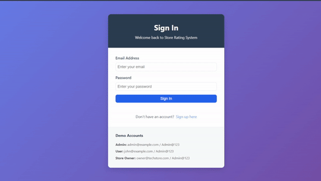

- #-- In Production --#
# Store Rating App

A modern full-stack web application that enables users to discover and rate local stores. Built with React.js for a responsive frontend, Express.js backend for robust API services, and PostgreSQL for reliable data storage.



## Features

[](https://github.com/Valay-2004/Store-Rating-App/pulls)
[](https://opensource.org/licenses/MIT)
[](https://nodejs.org/)

### User Roles
- **System Administrator**: Manage users, stores, and view analytics
- **Normal User**: Register, login, browse stores, and submit ratings
- **Store Owner**: View store ratings and user feedback

### Key Functionalities
- 🔐 Secure user registration and JWT authentication
- 👥 Role-based access control (Admin, Store Owner, User)
- 🏪 Complete store management system
- ⭐ Interactive 5-star rating system
- 🔍 Advanced search and filtering
- 📊 Real-time analytics dashboard
- ✅ Comprehensive form validation
- 📱 Fully responsive design
- 🌐 Modern, intuitive interface

## Tech Stack

### Backend
- **Node.js** & **Express.js** - Fast, unopinionated web framework
- **PostgreSQL** - Advanced open-source database
- **JSON Web Tokens** - Secure authentication
- **bcryptjs** - Password hashing
- **express-validator** - Input validation and sanitization
- **cors** - Cross-Origin Resource Sharing
- **dotenv** - Environment configuration

### Frontend
- **React.js 18+** - Modern React with hooks
- **React Router v6** - Client-side routing
- **Axios** - HTTP client with interceptors
- **Context API** - State management
- **CSS3** with CSS Variables - Modern styling
- **React Icons** - Comprehensive icon library

## Installation & Setup

### Prerequisites
- Node.js (v20.0.0 or higher)
- PostgreSQL (v17.0 or higher)
- npm (v10.0.0 or higher)
- Git

### Backend Setup
1. Clone the repository:

```bash
git clone https://github.com/Valay-2004/Store-Rating-App.git
cd fullstack-rating-app/server
```

2. Install dependencies:
```bash
npm install
```

3. Set up environment variables:
```bash
cp .env.example .env
# Edit .env with your database credentials
```

4. Set up the database:
```bash
# Connect to PostgreSQL
psql -U postgres

# Run the database initialization script
\i database/init.sql
```

5. Start the server:
```bash
npm run dev  # Development
npm start    # Production
```

### Frontend Setup

1. Navigate to client directory:
```bash
cd ../client
```

2. Install dependencies:
```bash
npm install
```

3. Set up environment variables:
```bash
cp .env.example .env
```

4. Configure your environment variables:
```env
REACT_APP_API_URL=http://localhost:5000/api
REACT_APP_NAME="<NAME>"
```

5. Start the development server:
```bash
npm start
```

The application will be available at `http://localhost:3000`

## API Endpoints

### Authentication
- `POST /api/auth/register` - Register new user
- `POST /api/auth/login` - User login
- `GET /api/auth/profile` - Get user profile
- `PUT /api/auth/password` - Update password

### Users (Admin only)
- `GET /api/users` - Get all users
- `GET /api/users/:id` - Get user by ID
- `POST /api/users` - Create new user
- `DELETE /api/users/:id` - Delete user
- `GET /api/users/stats` - Get user statistics

### Stores
- `GET /api/stores` - Get all stores
- `GET /api/stores/:id` - Get store by ID
- `POST /api/stores` - Create store (Admin only)
- `PUT /api/stores/:id` - Update store (Admin only)
- `DELETE /api/stores/:id` - Delete store (Admin only)
- `GET /api/stores/dashboard/my-store` - Get store dashboard (Store Owner)

### Ratings
- `POST /api/ratings/store/:storeId` - Submit rating
- `GET /api/ratings/store/:storeId/my-rating` - Get user's rating for store
- `PUT /api/ratings/:id` - Update rating
- `DELETE /api/ratings/:id` - Delete rating
- `GET /api/ratings/my-ratings` - Get user's all ratings
- `GET /api/ratings/store/:storeId` - Get store ratings

## Database Schema

### Users Table
- id (Primary Key)
- name (20-60 characters)
- email (Unique)
- password (Hashed)
- address (Max 400 characters)
- role (admin, user, store_owner)
- created_at, updated_at

### Stores Table
- id (Primary Key)
- name
- email (Unique)
- address (Max 400 characters)
- owner_id (Foreign Key to users)
- average_rating
- total_ratings
- created_at, updated_at

### Ratings Table
- id (Primary Key)
- user_id (Foreign Key to users)
- store_id (Foreign Key to stores)
- rating (1-5)
- created_at, updated_at
- Unique constraint on (user_id, store_id)

## Validation Rules

- **Name**: 20-60 characters, letters and spaces only
- **Email**: Standard email format validation
- **Password**: 8-16 characters, at least one uppercase letter and one special character
- **Address**: Maximum 400 characters
- **Rating**: Integer between 1 and 5

## Default Accounts

### Admin Account
- Email: admin@example.com
- Password: Admin@123

### Test Users
- Email: john@example.com, sarah@example.com
- Password: Admin@123

## Deployment

### Free Hosting Options
- **Frontend**: Vercel, Netlify
- **Backend**: Railway, Render (free tiers)
- **Database**: Neon, Supabase (PostgreSQL)

## Project Structure
```
fullstack-rating-app/
├── client/                 # React frontend
│   ├── public/            # Static files
│   └── src/
│       ├── components/    # Reusable components
│       ├── contexts/      # React contexts
│       ├── hooks/        # Custom hooks
│       ├── pages/        # Page components
│       ├── services/     # API services
│       └── utils/        # Utility functions
├── server/                # Express backend
│   ├── src/
│   │   ├── config/      # Configuration
│   │   ├── controllers/ # Route controllers
│   │   ├── middleware/  # Custom middleware
│   │   ├── models/     # Database models
│   │   └── routes/     # API routes
│   └── database/        # Database scripts
└── README.md            # Project documentation
```

## Contributing

We welcome contributions! Please follow these steps:

1. Fork the repository
2. Create your feature branch (`git checkout -b feature/AmazingFeature`)
3. Make your changes
4. Commit your changes (`git commit -m 'Add some AmazingFeature'`)
5. Push to the branch (`git push origin feature/AmazingFeature`)
6. Open a Pull Request


## Acknowledgments

* Icons provided by [React Icons](https://react-icons.github.io/react-icons/)
* Database hosting by [Neon](https://neon.tech)
* Deployment platform [Vercel](https://vercel.com)
